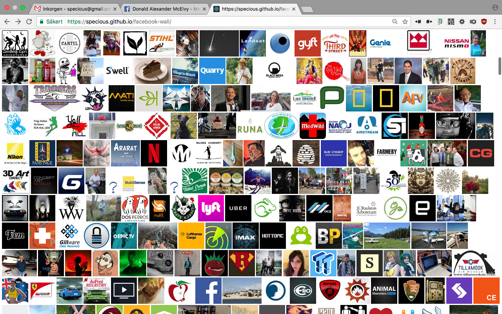
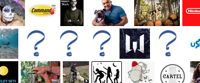
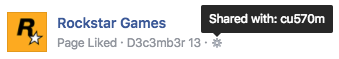

Browse and share your favorite Facebook pages.



## Instructions

First install and configure [facebook-cli](https://github.com/specious/facebook-cli). Then run:

```
make
```

Open `index.html` in your browser once the script has finished.

## Options

Synopsis:

```
make FORMAT=html|json ICON_HEIGHT=180
```

By default, icons are 180 pixels tall. A different size can be requested with:

```
make ICON_HEIGHT=92
```

Valid sizes range from 24 to 180 pixels.

By default the output will be an HTML fragment, but JSON can be generated by passing:

```
make FORMAT=json
```

## What's up with the "?" icons?

A small percentage of pages show up as a question mark instead of a profile picture:



That is due to the Facebook page's content privacy settings having been set to "custom" rather than "public", and therefore the image cannot be fetched without a Facebook authorization token:



Let the maintainers of those pages know that sharing their content with "public" could allow more people to interact with their content.

## License

ISC
